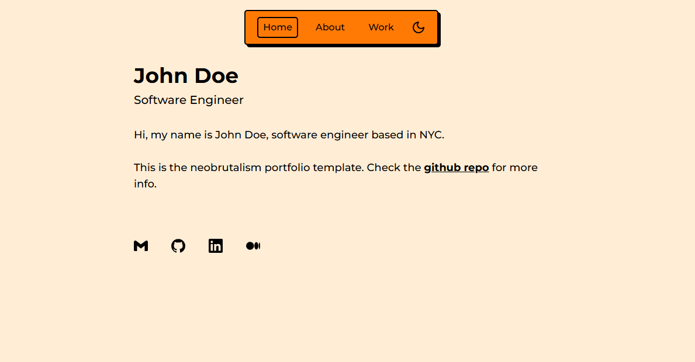

# Portfolio

Portfolio adalah template Next.js + Tailwind dengan gaya **neobrutalism** yang cocok untuk membuat website portofolio.

## Cara Instalasi

1. Clone atau buat repository baru dari template ini:

   [**Generate repository baru**](https://github.com/Galangxyz/JSOBFUSCATE-NEOBRUTALSM.git)

2. Install dependency:

   ```bash
   pnpm i
   ```

3. Jalankan lokal:

   ```bash
   pnpm run dev
   ```

## Konfigurasi Awal

- **Metadata →** Edit di `src/app/layout.tsx` (judul website, favicon, dll.)

  Contoh:
  
  ```ts
  export const metadata: Metadata = {
    title: 'John Doe',
    icons: {
      icon: '/favicon.ico',
    },
  }
  ```

- **Konten utama →** Edit di `src/app/page.tsx`

- **Favicon →** Letakkan file seperti `favicon.ico` di folder `public`, otomatis akan terbaca di metadata.

## Jalankan dengan PM2 (Production Mode)

1. Install pm2 (jika belum):

   ```bash
   npm install -g pm2
   ```

2. Jalankan project dengan pm2:

   ```bash
   pm2 start pnpm --name "namaproject" -- run dev
   ```

3. Simpan konfigurasi pm2 agar otomatis nyala saat reboot:

   ```bash
   pm2 save
   pm2 startup
   ```

## Tunneling dengan Cloudflare (systemctl)

1. Pastikan Cloudflare Tunnel sudah dikonfigurasi dan aktif.

2. Buat file service systemctl untuk cloudflared:

   ```bash
   sudo nano /etc/systemd/system/cloudflared.service
   ```

3. Isi file dengan konfigurasi:

   ```
   [Unit]
   Description=Cloudflare Tunnel
   After=network.target

   [Service]
   ExecStart=/usr/local/bin/cloudflared tunnel run namatunnel
   Restart=on-failure
   User=youruser

   [Install]
   WantedBy=multi-user.target
   ```

4. Enable dan start servicenya:

   ```bash
   sudo systemctl enable cloudflared
   sudo systemctl start cloudflared
   ```

## Mengatur Konten

- **Link di halaman utama →** Edit `src/components/links.tsx`
- **Proyek →** Letakkan gambar di folder `public`, atur path-nya di `src/data/projects.ts`
  
  Contoh:
  
  ```ts
  previewImage: '/my-project.png'
  ```

- **Rasio gambar →** Atur properti `ratio` di `AspectRatio` pada `app/work/page.tsx`

- **Skill →** Edit `src/data/skills.ts` untuk menambah bidang dan skill.

## Styling & Kustomisasi

- Baca dokumentasi styling di [neobrutalism.dev](https://neobrutalism.dev/styling)
- Salin pengaturan ke file CSS (`globals.css`)
- Sesuaikan tema di `ThemeProvider` sesuai kebutuhan

## Catatan Tambahan

Template ini cocok untuk belajar:

- Struktur Next.js modern
- Penggunaan Tailwind CSS dalam Next.js
- Implementasi dark mode
- Pemanfaatan TypeScript


## Konfigurasi Meta Tag

Metadata → Edit di src/app/layout.tsx (judul website, favicon, dll.)

Contoh:

export const metadata: Metadata = {
  title: 'John Doe',
  icons: {
    icon: '/favicon.ico',
  },
}

Konten utama → Edit di src/app/page.tsx

Favicon → Letakkan file seperti favicon.ico di folder public, otomatis terbaca di metadata.


### Styling & Kustomisasi

#### Untuk mengubah tampilan:

### Baca dokumentasi styling

### Salin pengaturan ke file CSS proyek (globals.css)

### Sesuaikan tema di ThemeProvider sesuai kebutuhan.


## Catatan Tambahan

Template ini cocok bagi yang ingin belajar:

1. Struktur Next.js modern

2. Penggunaan Tailwind CSS dalam Next.js

3. Implementasi dark mode

4. Pemanfaatan TypeScript


## Credits

Template dibuat oleh tim neobrutalism-templates.

©Galangxyz
